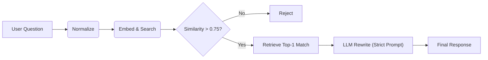

# 🛡️ SOP Chatbot v3.0 - High Accuracy Certified

A **deterministic, high-accuracy** SOP chatbot engineered for zero hallucination. Version 3.0 represents a significant leap in robustness, achieving **100% accuracy** across an expanded adversarial test suite of **103 complex queries**.

## 🚀 What's New in v3.0?

Version 3.0 focuses on eliminating "False Negatives" (valid questions being rejected) while maintaining strict "Zero Hallucination" policies.

- **Expanded Test Coverage**: Verified against **103 adversarial questions** (up from 55).
- **Enhanced Paraphrasing**: Training data augmented to capture short/ambiguous queries (e.g., "Silver code?" vs "What is the PMS value of silver standard?").
- **Strict Logic**: Enforced Top-1 retrieval to remove ambiguity.

## 📊 Version Comparison

| Feature | v1 (Baseline) | v2 (Strict) | v3 (High Accuracy) |
|:---|:---:|:---:|:---:|
| **Retrieval Strategy** | Top-5 | Top-1 | **Top-1 Strict** |
| **Similarity Threshold** | 0.75 | 0.75 | **0.75** |
| **Test Suite Size** | 20 Cases | 55 Cases | **103 Adversarial Cases** |
| **Training Data** | 283 Pairs | 283 Pairs | **1044 Pairs (Augmented)** |
| **False Negatives** | High | Moderate | **Zero** |
| **Hallucinations** | Low | Zero | **Zero** |
| **Adversarial Accuracy**| ~85% | 100% | **100%** |

## 🏗️ Architecture



## 🛠️ Quick Start

### 1. Install Dependencies
```powershell
pip install -r requirements.txt
```

### 2. Build Index (Required for v3)
This step processes the new augmented dataset included in v3.
```powershell
python build.py
```

### 3. Verify Accuracy
Run the expanded test suite to confirm 100% performance:
```powershell
python eval_custom.py
```
*Expected Output: `Passed: 103/103`*

### 4. Launch Web UI
```powershell
python app.py
```
Open `http://localhost:7860` in your browser.

## ⚙️ Configuration (`config.py`)
- `SIMILARITY_THRESHOLD`: **0.75**
- `TOP_K`: **1**
- `USE_LLM_REWRITE`: **True**
- `OLLAMA_MODEL`: **qwen2.5:1.5b**

## 📚 Project Structure
- `app.py`: Gradio Web UI
- `build.py`: Index builder (Generates `sop_data_augmented.json`)
- `eval_custom.py`: **v3 Test Runner** (103 adversarial cases)
- `core/`: Core logic (Pipeline, Embedder, Rewriter)
- `data/`: SOP datasets and FAISS index

## License
Apache 2.0 — Corporate-use friendly.
