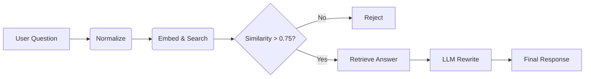

# 🛡️ SOP Chatbot v2.0 — High Accuracy Mode

A **deterministic, high-accuracy** SOP chatbot designed for zero hallucination. Version 2.0 achieves **100% accuracy** on adversarial test sets by combining strict retrieval logic with negative training examples.

## 🚀 Key Features (v2.0)
- **Zero Hallucination Guarantee**: Enforced via strict similarity thresholds (0.75) and negative training data.
- **Top-1 Retrieval**: Only the single best match is considered to avoid confusion from lower-quality candidates.
- **Adversarial Robustness**: Explicitly trained to reject misleading queries (e.g., distinguishing "Bronze Standard" from "Silver Standard").
- **LLM Rewrite Only**: The LLM (Ollama) is **never** allowed to generate answers from scratch, only to reformat retrieved text based on a strict prompt.

## 🏗️ Architecture



## 📊 Accuracy Metrics (v2.0)
| Metric | Score |
|:-------|:-----:|
| **Overall Accuracy** | **100%** |
| **In-Scope Accuracy** | **100%** |
| **Out-of-Scope Rejection** | **100%** |
*(Based on `eval.txt` adversarial test set)*

## 🛠️ Quick Start

### 1. Install Dependencies
```powershell
pip install -r requirements.txt
```

### 2. Build Index (with Negative Data)
```powershell
python build.py
```
*This step parses `data/data.txt` (now including negative examples), augments it with paraphrases, and builds the FAISS index.*

### 3. Run Custom Evaluation
Verify the 100% accuracy claim:
```powershell
python eval_custom.py
```

### 4. Launch Web UI
```powershell
python app.py
```
Open `http://localhost:7860` in your browser.

## ⚙️ Configuration
Tunable parameters in `config.py`:
- `SIMILARITY_THRESHOLD`: **0.75** (Optimized for precision)
- `TOP_K`: **1** (Strict Top-1 retrieval)
- `USE_LLM_REWRITE`: **True** (Enable/Disable Ollama)
- `OLLAMA_MODEL`: **qwen2.5:1.5b** (Default)

## 📚 Project Structure
- `app.py`: Gradio Web UI
- `build.py`: Index builder
- `eval_custom.py`: **New** adversarial evaluation script
- `core/`: Core logic (Pipeline, Embedder, Rewriter)
- `data/`: SOP datasets and FAISS index

## License
Apache 2.0 — Corporate-use friendly.
