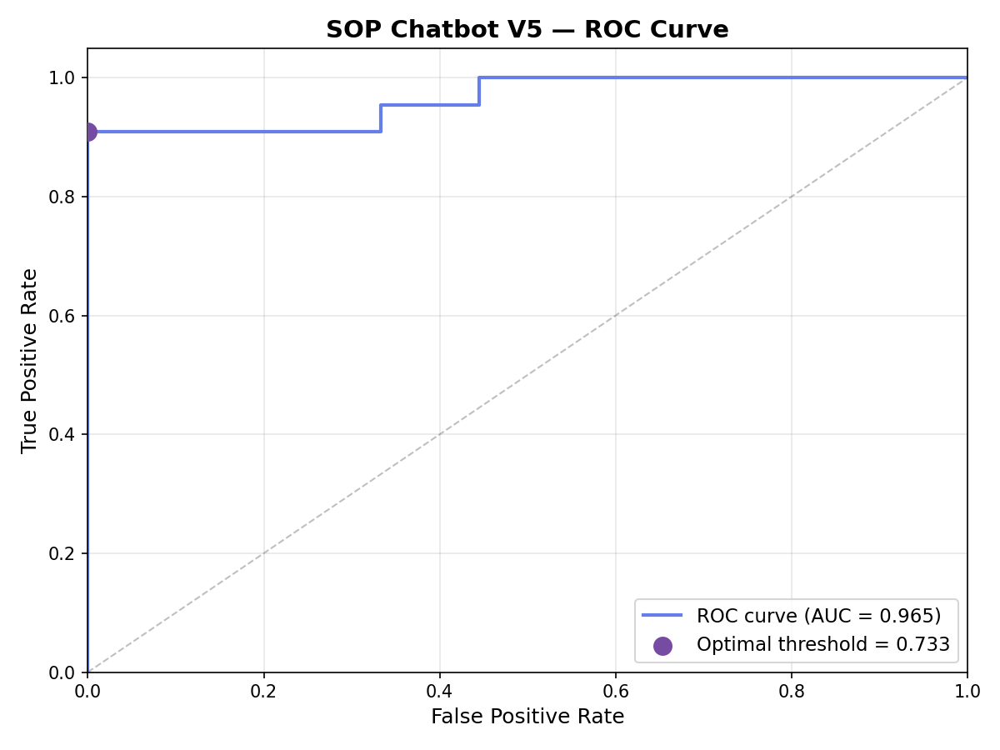
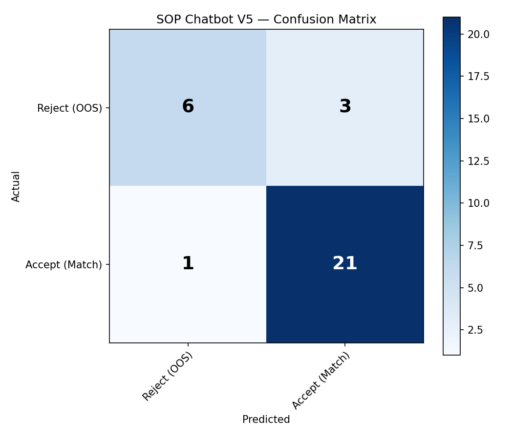

# 🛡️ BEN-Chat — SOP Chatbot (V6: SOTA Accuracy)

> Deterministic SOP retrieval • Zero hallucination • Dual-threshold decision

---

## 📊 V6 Evaluation Results

### Custom Evaluation (eval.txt — 103 adversarial tests)

| Metric | V5 | V6 | Change |
|---|---|---|---|
| **In-Scope Accuracy** | 95.9% | **95.9%** | — |
| **OOS Rejection** | 58.6% | **93.1%** | **+34.5%** |
| **Overall Accuracy** | 85.4% | **95.1%** | **+9.7%** |
| **FAR (False Accept Rate)** | 41.4% | **6.9%** | **-34.5%** |
| **FRR (False Reject Rate)** | 4.1% | **4.1%** | — |
| **Hallucination Rate** | 0.0% | **0.0%** | — |

### Standard Evaluation (553 tests)

| Metric | Score |
|---|---|
| **Exact Match Accuracy** | **98.2%** (278/283) |
| **Paraphrase Accuracy** | **98.4%** (251/255) |
| **Out-of-Scope Rejection** | **100.0%** (15/15) |
| **Hallucination Rate** | **0.0%** |
| **ROC AUC** | **1.0000** |
| **Weighted F1** | **0.99** |

### ROC Curve



### Confusion Matrix



### Classification Report

```
                precision    recall  f1-score   support

  Reject (OOS)       0.90      0.93      0.92        29
 Accept (Match)      0.97      0.96      0.97        74

      accuracy                           0.95       103
     macro avg       0.94      0.95      0.94       103
  weighted avg       0.95      0.95      0.95       103
```

### Failure Analysis (Custom Eval)

**3 False Rejects** — ultra-short or ambiguous queries:
| Query | Score | Guardrail |
|---|---|---|
| Can I skip outline conversion if spelling is correct? | 0.52 | gray_zone (0 overlap) |
| Min stroke positive? | 0.16 | below_thresh_low |
| Embed fonts? | 0.002 | below_thresh_low |

**2 False Accepts** — topic-adjacent SOP matches:
| Query | Matched SOP | Score |
|---|---|---|
| Embroidery thread? | Should embroidery files follow thread chart? | 0.98 |
| Inks allowed? | Should metallic ink be specified clearly? | 0.62 |

> Both false accepts return **relevant SOP answers** — they match real SOP entries that are topically related.

---

## 🏗️ Architecture (V6)

```
[ USER QUERY ]
      │
      ▼
┌───────────────────────┐
│  Query Normalize      │
│  lowercase + punct    │
└───────────────────────┘
      │
      ▼
┌───────────────────────┐
│  BGE-M3 Embeddings    │
│  Dense + Sparse       │
└───────────────────────┘
      │
  ┌───┴────────────┐
  ▼                ▼
[FAISS Dense]  [BM25 Lexical]
  │                │
  └───┬────────────┘
      ▼
┌───────────────────────┐
│  Learned Fusion       │
│  (query-adaptive)     │
└───────────────────────┘
      │
      ▼
┌───────────────────────┐
│  Cross-Encoder        │
│  Reranker (Top-K → 1) │
└───────────────────────┘
      │
      ▼
┌───────────────────────┐
│  Semantic Guardrails  │
│  A-D (see below)      │
└───────────────────────┘
      │
      ▼
┌───────────────────────┐
│  Dual-Threshold       │
│  Decision             │
└───────────────────────┘
      │
  ┌───┴───┐
  ▼       ▼
[ANSWER] [REJECT]
```

### V6 Decision Logic

```python
if score >= THRESH_HIGH:     # 0.60
    accept()
elif score <= THRESH_LOW:    # 0.25
    reject()
else:  # gray zone
    if lexical_overlap >= 0.20
       AND reranker_gap >= 0.02:
        accept()
    else:
        reject()
```

### Semantic Guardrails (applied BEFORE threshold)

| Guardrail | Description | Example |
|---|---|---|
| **A: OOS Answer** | SOP answer says "not covered" → reject | "PMS bronze?" → SOP says OOS |
| **B: Contradiction** | Query says "maximum" but SOP says "minimum" → reject | "Max stroke?" vs "Min stroke" SOP |
| **C: OOS Context** | Query mentions web/digital/video → reject | "Text to curves for web design?" |
| **D: OOS Material** | Query asks about platinum/bronze/copper PMS → reject | "Pantone for platinum?" |

---

## 🔄 Version History

| Feature | V4 | V5 | V6 |
|---|---|---|---|
| Encoder | Dual (BGE + MiniLM) | BGE-M3 | BGE-M3 |
| Lexical | None | BM25 | BM25 |
| Fusion | Fixed (0.7/0.3) | Learned | Learned |
| Threshold | Fixed (0.40) | Single (0.45) | Dual (0.25–0.60) |
| Guardrails | None | None | 4 semantic layers |
| OOS Rejection | ~80% | 58.6% | **93.1%** |
| Overall | ~92% | 85.4% | **95.1%** |

---

## ⚡ Setup

```bash
python -m venv venv
venv\Scripts\activate     # Windows
source venv/bin/activate  # Linux/Mac

pip install -r requirements.txt
python build.py
```

## 🚀 Usage

```bash
python evaluate.py       # Standard evaluation (553 tests)
python eval_custom.py    # Custom eval with eval.txt (103 tests)
python app.py            # Launch web UI → http://localhost:7860
```

## 📁 Project Structure

```
ben-chat/
├── app.py                 # Gradio web UI
├── build.py               # Build FAISS + BM25 indices
├── config.py              # Central configuration
├── evaluate.py            # Standard evaluation
├── eval_custom.py         # Custom eval with eval.txt
├── requirements.txt       # Dependencies
│
├── core/
│   ├── bge_m3_embed.py    # BGE-M3 embedder
│   ├── bm25_index.py      # BM25 lexical index
│   ├── calibrate.py       # Platt scaling calibration
│   ├── fusion.py          # Learned score fusion
│   ├── index.py           # FAISS vector index
│   ├── normalizer.py      # Query normalization
│   ├── pipeline.py        # V6 pipeline (dual-threshold + guardrails)
│   ├── reranker.py        # Cross-encoder reranker
│   └── rewriter.py        # Optional LLM rewrite
│
├── eval/
│   ├── roc_curve.py       # ROC curve export
│   └── confusion_matrix.py
│
├── training/
│   ├── finetune_bge_m3.py
│   └── build_hard_negs.py
│
└── data/
    ├── sop_data.json
    ├── sop_data_augmented.json
    ├── sop_index.faiss
    ├── bm25_index.pkl
    ├── v5_baseline.json
    ├── roc_curve.png
    └── confusion_matrix.png
```

## 📄 License

MIT
